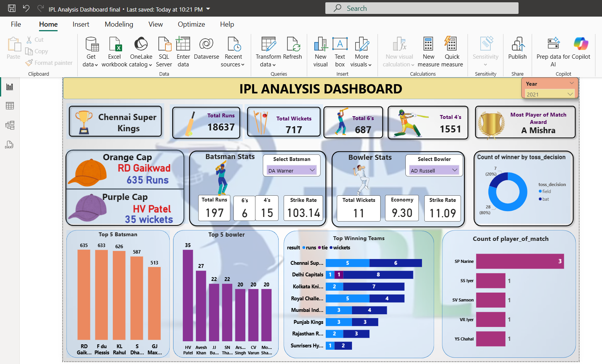

# 🏏 IPL Analysis Dashboard using Power BI

An interactive **Power BI dashboard** analyzing Indian Premier League (IPL) match data — covering team performance, batsman and bowler stats, toss decisions, and top individual performers, filterable by season.

🔗 **Repository:** [IPL-Dashboard-using-PowerBI](https://github.com/niharikakt024/IPL-Dashboard-using-PowerBI)

---

## 🖥️ Dashboard Preview

A single-page view combining season KPIs, player-level stats with searchable slicers, and team/toss performance breakdowns, filterable by year.



---

## ✨ Key Features

- **Year Filter** — Analyze a specific IPL season (e.g., 2021)
- **KPI Cards** — Champion team, Total Runs, Total Wickets, Total 6's, Total 4's, and Most Player of the Match Award
- **Orange & Purple Cap** — Top run-scorer and top wicket-taker of the season
- **Batsman Stats** — Searchable batsman selector showing Total Runs, 6's, 4's, and Strike Rate
- **Bowler Stats** — Searchable bowler selector showing Total Wickets, Economy, and Strike Rate
- **Toss Decision Analysis** — Donut chart of match wins by bat/field toss decision
- **Top 5 Batsman & Bowler** — Season leaderboards by runs and wickets
- **Top Winning Teams** — Breakdown of wins by result type (runs, tie, wickets) per team
- **Count of Player of the Match** — Ranked list of most frequent Player of the Match winners

---

## 🛠️ Tech Stack

- **Tool:** Microsoft Power BI Desktop
- **Data Modeling:** Star schema with match, ball-by-ball, batsman, bowler, and team dimension tables
- **DAX:** Custom measures for strike rate, economy, toss-decision win %, and top-N rankings
- **Data Source:** Historical IPL match and ball-by-ball data

---

## 📁 Repository Structure

```
IPL-Dashboard-using-PowerBI/
│
├── IPL Analysis Dashboard final.pbix          # Power BI dashboard file
├── deliveries.xlsx                  # Deliveries dataset 
├── matches.csv                   # Matches dataset
├── dashboard_overview.png.png            # Dashboard preview images
└── README.md                # Project documentation
```

---

## 🚀 Getting Started

1. Clone the repository
   ```bash
   git clone https://github.com/niharikakt024/IPL-Dashboard-using-PowerBI.git
   ```
2. Open the `.pbix` file in **Power BI Desktop**
3. Refresh the data source (if connected to live data)
4. Use the Year filter and Batsman/Bowler selectors to explore player and team performance

---

## 📈 Key Insights

- **Chennai Super Kings** were the champions of the 2021 season
- **RD Gaikwad** topped the run charts with **635 runs** (Orange Cap), while **HV Patel** led wicket-taking with **35 wickets** (Purple Cap)
- **A Mishra** won the Most Player of the Match Award for the season
- Teams winning the toss chose to **field 80%** of the time, showing a strong bowl-first bias
- **Delhi Capitals** posted the most wins by result type combined, with a mix of both run-based and wicket-based victories
- **SP Narine** led the season in individual Player of the Match awards with 3 wins

---


## 👨‍💻 Author

**Niharika K T**

**Aspiring Data Analyst | Power BI | SQL | Excel | Python | Data Visualization**

📧 Email: niharikakt024@gmail.com  
🔗 LinkedIn: www.linkedin.com/in/niharika-k-t-8a1a2728a  
💻 GitHub: https://github.com/niharikakt024

---

⭐ If you find this project useful, consider giving the repository a star!
